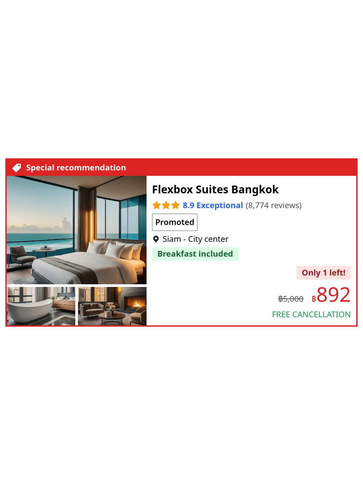

# Challenge: Hotel recommendation

## Reference

## Objectives

- สร้างการ์ดโรงแรม ประกอบด้วย พื้นที่สำหรับรูปภาพทางด้านซ้าย และข้อมูลทางด้านขวา ครอบด้วยกล่องสีแดงที่มีไอคอนรูปป้ายราคา และมีข้อความว่า “<em>Special recommendation</em>”

  - รูปป้ายราคา: <em>/images/price-label-white.svg</em>

- เพิ่มรูปภาพ 3 รูป แบ่งเป็น 2 แถว โดยแถวแรกมีภาพ 1 ภาพ และแถวที่สองมี 2 ภาพ มีช่องว่างระหว่างภาพเล็กๆ แต่ไม่มีช่องว่างระหว่างภาพกับกรอบที่ล้อมรอบ

  - Image 1: <em>/images/bed.jpg</em>
  - Image 2: <em>/images/bath.jpg</em>
  - Image 3: <em>/images/sofa.jpg</em>

- ในส่วนที่แสดงข้อมูล ใส่ชื่อโรงแรมที่ด้านบน และใส่ราคาที่ด้านล่างขวา

  - ชื่อโรงแรม: <em>Flexbox Suites Bangkok</em>
  - ราคาเดิม: <em>฿5,000</em> มีขีดฆ่า
  - ราคาที่ลดแล้ว: <em>฿892</em> เป็นตัวหนังสือสีแดงที่ใหญ่กว่า โดยด้านล่างมีข้อความ “<em>FREE CANCELLATION</em>” เป็นสีเขียว

- ใส่คะแนนใต้ชื่อโรงแรม ซึ่งประกอบด้วย

  - ดาวสีทอง 3 ดวง - รูปดาว: <em>/images/star-amber-500.svg</em>
  - ข้อความว่า “<em>8.9 Exceptional</em>” เป็นสีน้ำเงิน
  - ข้อความว่า “<em>(8,774 reviews)</em>”

- ในส่วนที่แสดงข้อมูล ให้ใส่รายละเอียดเพิ่มเติมดังนี้

  - แถวที่แสดงข้อความ “<em>Promoted</em>” มีเส้นขอบรอบข้อความ
  - แถวที่แสดงตำแหน่งโรงแรม “<em>Siam - City center</em>” - รูปหมุด: <em>/images/pin-neutral-800.svg</em>
  - แถวที่แสดงข้อความสีเขียว “<em>Breakfast included</em>”
  - แถวที่แสดงข้อความสีแดง “<em>Only 1 left!</em>”

- Create a hotel card with images section on the left, information on the right, wrapped
  in a red box whose title has a price tag icon and text “<em>Special recommendation</em>”.

  - Price tag icon: <em>/images/price-label-white.svg</em>

- Add 3 images to the images section. The image section has 2 rows. First row has
  one image, the second row has 2 images. There is a little space between images
  but there is no space between the image and enclosing box.

  - Image 1: <em>/images/bed.jpg</em>
  - Image 2: <em>/images/bath.jpg</em>
  - Image 3: <em>/images/sofa.jpg</em>

- Hotel name at the top and price at the bottom right.

  - Hotel name: <em>Flexbox Suites Bangkok</em>
  - Original price: <em>฿5,000</em> with strikethrough
  - Discounted price: <em>฿892</em> in bigger red text, below with words “<em>FREE CANCELLATION</em>” in green.

- Rating below hotel name, consists of:

  - 3 yellow-orange stars - star image: <em>/images/star-amber-500.svg</em>
  - “<em>8.9 Exceptional</em>” in blue
  - “<em>(8,774 reviews)</em>”

- More detailed section as follows:

  - A “<em>Promoted</em>” row with a border
  - A location row with text “<em>Siam - City center</em>” - pin image: <em>/images/pin-neutral-800.svg</em>
  - A green “<em>Breakfast included</em>” row
  - A red “<em>Only 1 left!</em>” row.

